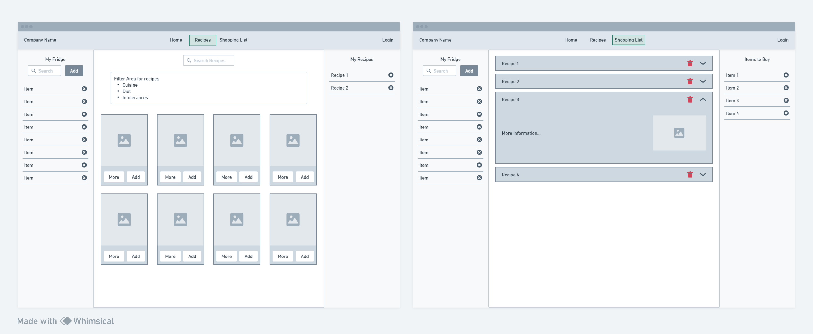

# Fridgefy

This is a Web app that allows you to store your recipes in the shopping list and check the ingredients.
Recipes can be filtered by ingredients, cuisine, diet and intolerances.

## Features

### All users

- Search for recipes with filters (cuisine, diet and intolerances).

### Registered users

- Add ingredients to the fridge to filter recipes.
- Add recipes to the shopping list.
- Check the ingredients of the recipes in the shopping list.

## Setup

## Usage

## Pages

- Home page
- Recipes page with search and filters
- Shopping list page

## API

- https://spoonacular.com/food-api

## Authentication

- By Google (Firebase Authentication)

## Tech

- Next
- Styled Components
- Redux

## Design

